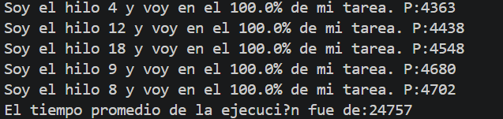

# ARSW Taller Sincronización - Patrón de sincronización por barrera

## 1.Descargue e importe el proyecto.


## 2.Revise el programa principal.

### ¿Cuál es el resultado obtenido?
Al ejecutar el programa, el resultado típico será:


### ¿Es correcto?
No, el resultado NO es correcto. El programa debería esperar a que todos los hilos terminen su ejecución antes de calcular el promedio, pero no lo hace.

### ¿Por qué se da este resultado?
El problema está en la forma en que se calcula el tiempo promedio:
```java
long tiempoPromedio=0;
		
for (int i=0;i<numHilos;i++){
	tiempoPromedio+=hilos[i].getResultado();
}

System.out.println("El tiempo promedio de la ejecuci�n fue de:"+tiempoPromedio/numHilos);
```
Este código se ejecuta inmediatamente después de iniciar los hilos, sin esperar a que terminen.

Cuando se llama a `getResultado()` en cada hilo:

- El método `run()` aún no ha terminado (los hilos están en ejecución o ni siquiera han comenzado a ejecutarse realmente).

- El campo resultado de cada HiloProc se inicializa con valor 0.

- Solo se actualiza al final del método `run()`, cuando el hilo completa su tarea.

Como el hilo principal (main) no espera a que los hilos terminen, obtiene el valor inicial 0 de cada hilo, calcula 0/20 = 0.

## 3. Aplique una estrategia de sincronización por barrera

### Solución implementada
Se modificó el programa principal para implementar una barrera de sincronización utilizando el método `join()` de la clase `Thread`. Esta estrategia garantiza que el hilo principal espere activamente a que cada hilo termine su ejecución antes de calcular el promedio de los tiempos.

### Código resultante

```java
for (int i = 0; i < numHilos; i++) {
	try {
		hilos[i].join();
	} catch (InterruptedException e) {
		e.printStackTrace();
	}
}
```
### Explicación del mecanismo de barrera

- Punto de sincronización: Después de iniciar todos los hilos con start(), se establece un punto de barrera donde el hilo principal debe esperar.

- Comportamiento de join(): Cada llamada a hilos[i].join() hace que el hilo principal se "duerma" (se bloquee) hasta que el hilo correspondiente complete su método run().

- Espera activa: El primer join() espera al primer hilo, el segundo join() espera al segundo, y así sucesivamente. El hilo principal solo avanza cuando el hilo actual ha terminado.

- Despertar: Cuando el último hilo (el que tarda más tiempo) completa su ejecución, el último join() se desbloquea y el programa continúa.

- Cálculo del promedio: Una vez superada la barrera (todos los hilos han terminado), se recogen los resultados reales de cada hilo y se calcula el promedio correctamente.

### Resultado


### Ventajas 

- Simplicidad: Usa mecanismos nativos del lenguaje sin librerías adicionales.

- Garantía de sincronización: Asegura que el promedio se calcule solo cuando todos los hilos han finalizado.

- Legibilidad: El código es claro y fácil de entender.

- Eficiencia: No consume recursos de CPU mientras espera (el hilo principal está bloqueado, no en busy-waiting).