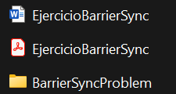

# ARSW Taller Sincronización - Patrón de sincronización por barrera

## 1.Descargue e importe el proyecto.


## 2.Revise el programa principal.

### ¿Cuál es el resultado obtenido?
Al ejecutar el programa, el resultado típico será:


### ¿Es correcto?
No, el resultado NO es correcto. El programa debería esperar a que todos los hilos terminen su ejecución antes de calcular el promedio, pero no lo hace.

### ¿Por qué se da este resultado?
El problema está en la forma en que se calcula el tiempo promedio:
```java
long tiempoPromedio=0;
		
for (int i=0;i<numHilos;i++){
	tiempoPromedio+=hilos[i].getResultado();
}

System.out.println("El tiempo promedio de la ejecuci�n fue de:"+tiempoPromedio/numHilos);
```
Este código se ejecuta inmediatamente después de iniciar los hilos, sin esperar a que terminen.

Cuando se llama a getResultado() en cada hilo:

- El método run() aún no ha terminado (los hilos están en ejecución o ni siquiera han comenzado a ejecutarse realmente).

- El campo resultado de cada HiloProc se inicializa con valor 0.

- Solo se actualiza al final del método run(), cuando el hilo completa su tarea.

Como el hilo principal (main) no espera a que los hilos terminen, obtiene el valor inicial 0 de cada hilo, calcula 0/20 = 0.